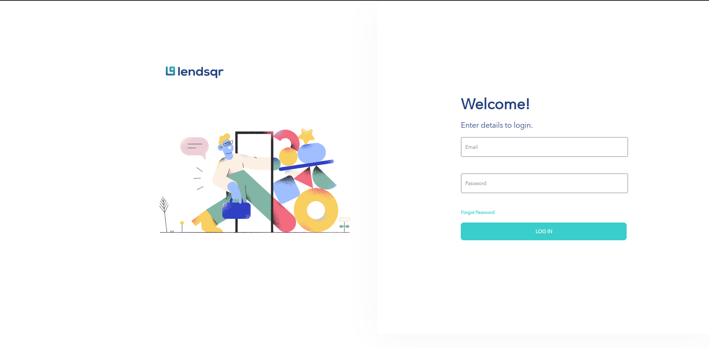
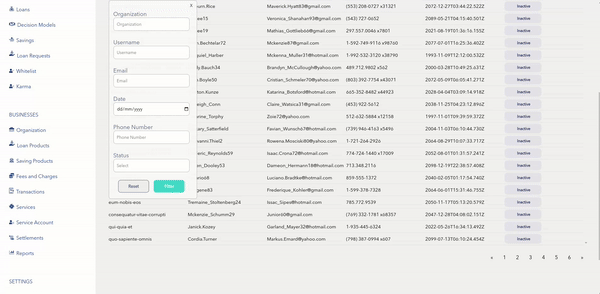
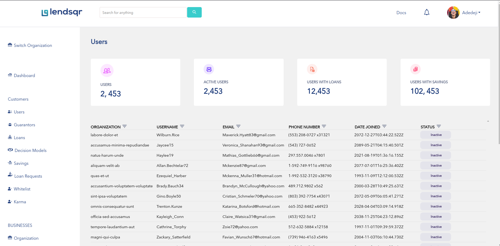
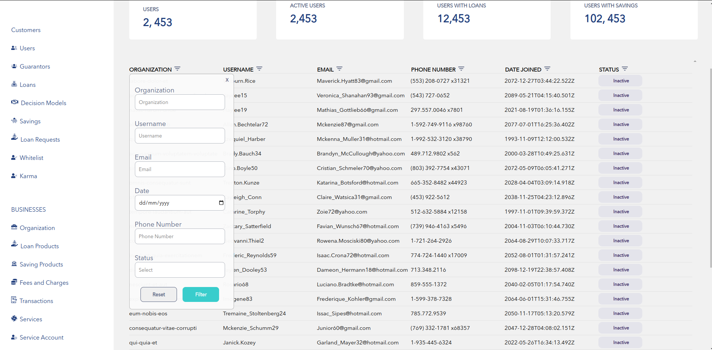

<h1>
 
lendsqr-fe-test 
</h1>


<p align="center"></p>
<p align="center"></p>

<p align="center"></p>

<p align="center"></p>


<hr/>
<a href="https://mbonuchinedum-lendsqr-fe-test.herokuapp.com/"> Project Link </a>

## Description 

<p>
At <b>Lendsqr </b>, many of our lenders use our mobile apps to reach over half a million customers. <br> 

At this scale, we use <b> React </b> with TypeScript and SCSS as its frontend software development stack which allows us to rapidly ideate and release features rapidly and reliably.

</p>

## Problem Statement 

<p> This application comprises of the following features: 
<ul>
<li> Build 4 pages </li>
<li> Login, Dashboard, User page, User details page </li>
<li> The user pages should pull data from a mock api with 500 records </li>
<li> Use local storage or indexedDB to store and retrieve user details on the user details page. </li>
<li> The page must be mobile responsive </li>
</ul> <br>


## Pusing to Heroku 

<p> From your terminal type the following to host this application on 
heroku </p>

```
$ heroku login
$ heroku create 
$ heroku rename <"app-new-name">
$ git add .  
$ git push heroku master 
```
<br>

## Download & Installation 

<p> To download this application, in your terminal clone a copy of this repo and type the following inside the directory </p>

```shell 
$ git clone "https://github.com/cboychinedu/lendsqr-fe-test" 
```
<p> The type the following code below to install all necessary dependencies. 
</p>

```shell
$ npm install .
```
<br> 

## Running the application 
<p>
 To run the application, open a terminal in your working directory where the files are located, and in the root folder, type the commands below. 
</p>

```shell
$ npm start  
```
<p>
 This would start the react application and open a browser for you to view the web application on localhost. 

</p>

<br> 

## Building the application 
<p>
The npm build is used to build a package. 
This occurs where a <package-folder> is a folder that contains a <b>package.json</b> in its root. <br> 
This is the plumbing command that is called by npm link and npm install.
<br>

To build the application, open a terminal in your working directory, and type the following commands. 
</p>
<br> 

```shell 
$ npm run build 
``` 


<br>

## Help

<p>
Contact me for references 
<ul>
    <li> <b> Email:</b> cmbonu@protonmail.com </li> 
    <li> <b>Number:</b> +234-7081-528827 </li>
    <li> <b> Number: </b> +234-9030-045587 </li> 
</ul>
</p>
<br>

### Authors 

<br> 

 Name | Image | 
------------ | -------------
|  |  Mbonu Chinedum | 

### Company 
*  <b> Lendsqr </b> 


### Version History

* Version 1.0.0 

<br>

### License
* MIT 
* Apache 

<br>

### Acknowledgments
<p>
   All thanks to God Almighty. 
</p>
